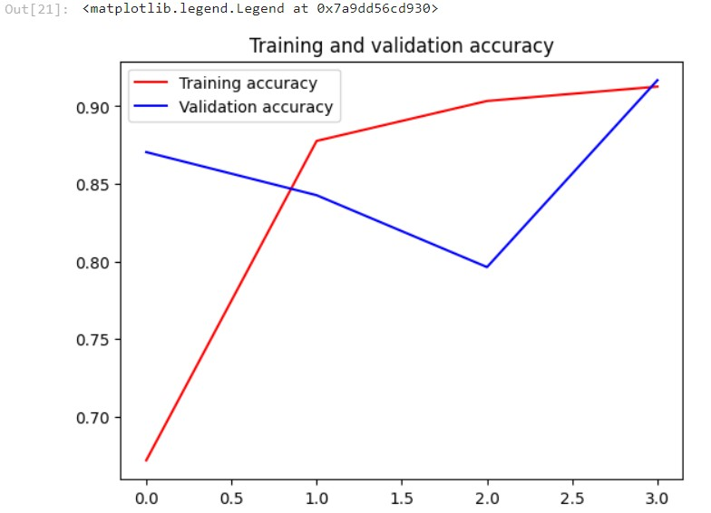
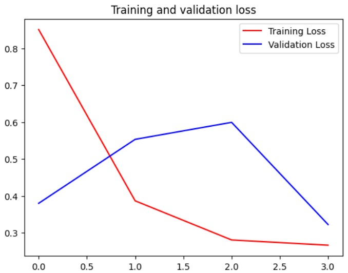
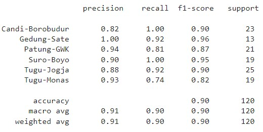

# ML Repository (Landmark Recognition) - Destinology (Team CH2-PS397)

Member of Machine Learning
| Member | Student ID | University |
|:------:|:----------:|:----------:|
| Muhammad Fakhriza Fauzan Didaputra | M011BSY1707 | Universitas Padjadjaran|
| Muhammad Radiga Gubarda | M011BSY0712 | Universitas Padjadjaran |
| Hubert Nathanael Christidyawan | M002BSY0362 | Bandung Institute of Technology |

## Tourism, Cultural, and Hospitality - Landmark Recognition
### Overview
This repository contains the code for a landmark recognition project focusing on landmarks in Indonesia. The project utilizes TensorFlow and Convolutional Neural Networks (CNN) to achieve accurate landmark recognition.

### Dataset
Our dataset comprises a total of 1.749 images distributed across 6 classes, with the following specifications.
| Class | Amount of Images |
|:------:|:----------:|
| Candi-Borobudur | 249 Images |
| Gedung-Sate | 200 Images |
| Patung-GWK | 357 Images |
| Suro-Boyo | 202 Images |
| Tugu-Jogja | 325 Images |
| Tugu-Monas | 416 Images |

### Architecture
The primary model employs transfer learning from MobileNetV2, incorporating additional custom layers. The input involves images resized to 224 x 224 x 3, and the model is constructed by combining MobileNetV2 (16 residual bottleneck layers) with three newly added dense layers. Subsequently, the model is compiled using the RMSprop optimizer with a learning rate of 0.0005. The ultimate output is the classification of Indonesian Landmarks into 6 distinct classes.

### Performance
#### Accuracy


#### Loss


#### Classification Report


### Usage
Requirement to install: tensorflow, sklearn, pandas, seaborn, and matplotlib.
1. Clone the repository:
```
git clone https://github.com/mvrsa/Machine-Learning-for-Landmark-Recognition.git
```
2. Installation:
```
pip install -r requirements.txt
```
3. Run the main script **Transfer Learning.ipynb**
4. The model saved as **Landmark-r.h5**
